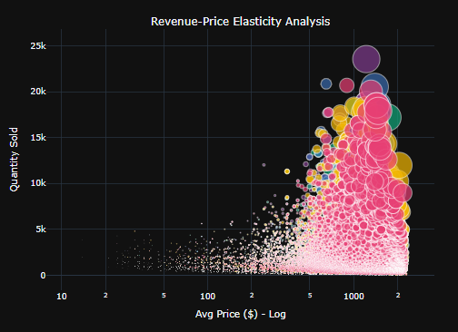
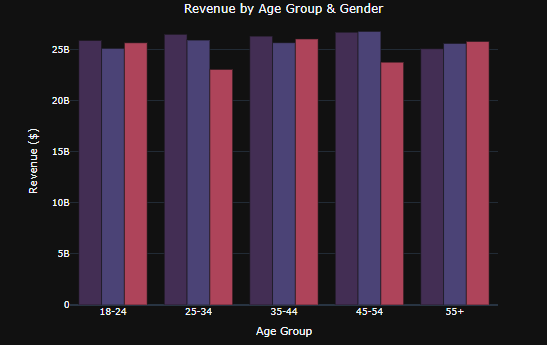
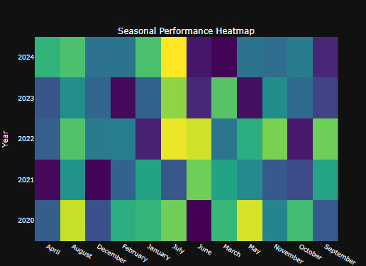
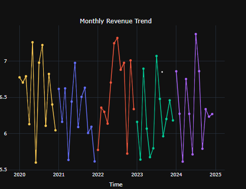
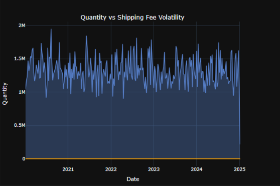
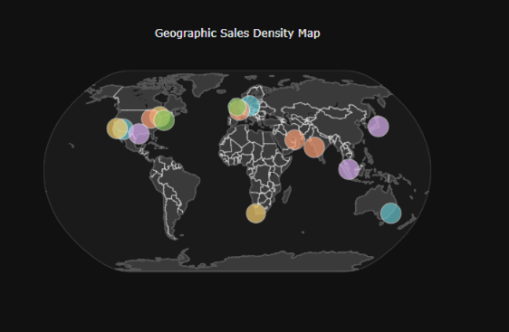

#  Retail Insights Dashboard — Datathon Project

*A data analytics dashboard exploring pricing, revenue, customer behaviour & geographic sales patterns.*

---
##  Project Overview

This dashboard provides end-to-end business analytics on retail sales data using Python and Plotly.
It uncovers product performance, customer demographics, seasonal patterns, and geographic demand through a series of clean, intuitive visualizations.

The goal is to support decision-making by identifying revenue drivers, pricing opportunities, product categories, and location-based sales insights.

---

## Visualizations Included

🔵 **Bubble Chart — Revenue vs Price Elasticity**
- Avg Net Price (log scale) vs Total Quantity Sold  
- Bubble size: Total Revenue
  

🟪 **Stacked Bar Chart — Revenue by Age Group & Gender**
- Breakdown of total revenue by customer age group  
- Stacked by customer gender
  

  
🟧 **Weekly Time-Series — Quantity vs Avg Shipping Fee**
- Area chart: Weekly quantity sold  
- Line chart: Avg weekly shipping fee (secondary axis)  
- Shows demand trends and volatility

  
🌡️ **Heatmap — Monthly Revenue Across Years**
- Displays total revenue for each month across multiple years  
- X-axis: Month, Y-axis: Year  
- Color intensity indicates revenue magnitude

  
 💸 **Weekly Quantity vs Shipping Fee Volatility**
- Shows how changes in shipping fees impact purchase quantity  
- Highlights periods of high demand and cost sensitivity

  
🗺️ **Geographic Sales Map**
- Bubble map using latitude and longitude  
- Bubble size: Revenue per location  
- Color: Top-selling category  
- Shows geographic sales density and category preference

---
## Team
**Team Name:** *Team-S2-IEEE-Datathon*

**Team Members:** *Shreyaa and Shreiya*
